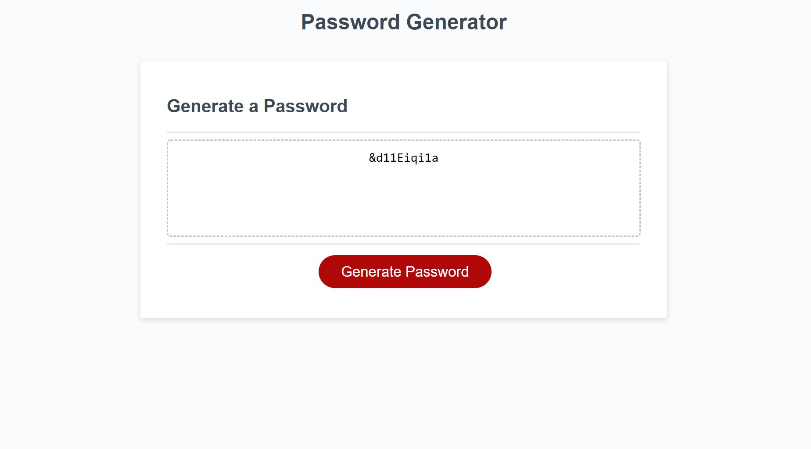

# **Password Generator**

## **Purpose Of The Project**

This application enables users to generate random passwords based on criteria that they have selected. From the prompt window the user gets to choose if they want uppercase, lowercase, numbers, and special characters in their password. After answering those questions, the application generates a password and displays it on the page.

## **Screenshot/Images**

## **Links To The Page**

[GitHub Page](https://github.com/ettad/semantic-html)

[GitHub Repository](https://github.com/ettad/semantic-html)

